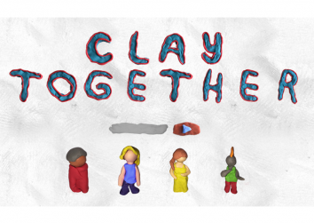
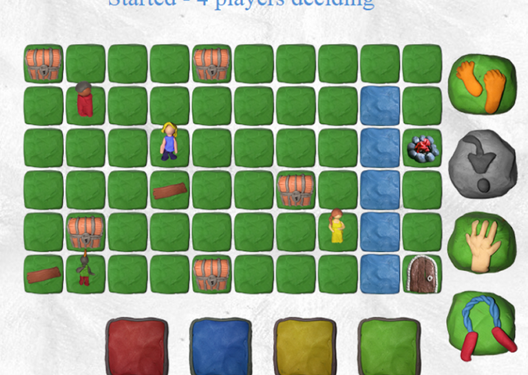
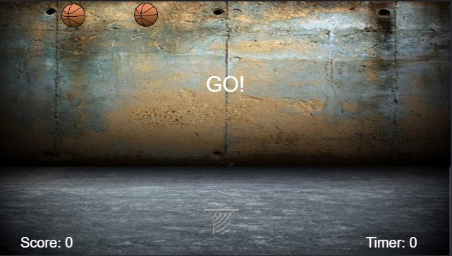
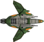
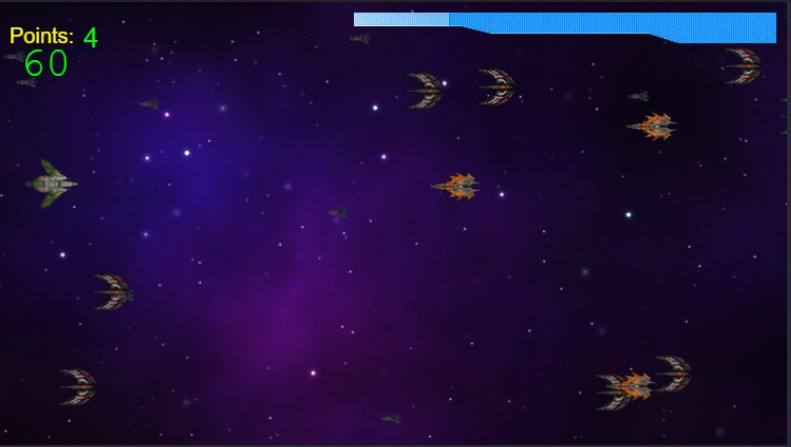
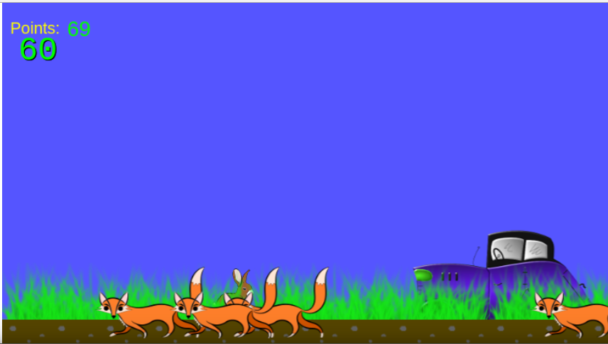
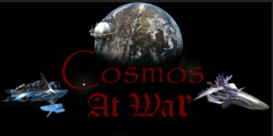

### Hi there 👋 I'm stof

You may know me as Chris Langton

Here are some things to know about my coding:

- 🔭 I’m currently working on [Trivial Security](https://gitlab.com/trivialsec)
- 🌱 I’m currently learning how to be successful as a bootstrapped SaaS start-up
- 👯 I’m looking to collaborate on [Cybersecurity Research](mailto:chris@trivialsec.com)
- 🤔 I’m looking for help with [Front-end coding](mailto:chris@trivialsec.com)
- 💬 Ask me about Node.js, Python, Golang, PHP, Machine Learning, AWS, Secure Coding, DevSecOps, Kubernetes, and all things Linux
- 📫 How to reach me: 

### ⚡ Fun fact

I first wrote some BASIC in 1997 and at least 1-5k lines of code a month ever since, but I always take the time to get in the surf, snowboard, hike, exercise, see concerts, travel the world, and visit all sorts of towns and places in Australia. I never do anything unless I'm multitasking, when watching TV I'm coding or playing a game, when out doing errands or even when coding I'm listening to a podcast or have a streamer on the side, audiobooks are great for driving or falling asleep to, and music is the best for cooking or working for a client.

The only time I am focussed on one thing at a time is when I'm with family or friends, then they have my full attention.

Life is too short to spend most of it doing one thing at a time.

### Games

|  [Clay Together](https://gitlab.com/chrislangton/clay-together) global game jam 2015 |
|---|
|  |
|  |

|  [Droptime](https://gitlab.com/chrislangton/droptime) global game jam 2016 |
|---|
|  |

|  [space shooter](https://gitlab.com/chrislangton/canvas-game) Phaser.io Game |
|---|
|  |

|  [mouse bun roo](https://gitlab.com/chrislangton/ludum-dare-35) mouse bun roo Ludum Dare 35 |
|---|
|  |

| [cosmos at war](https://gitlab.com/chrislangton/caw-game) |
|---|
|  |
